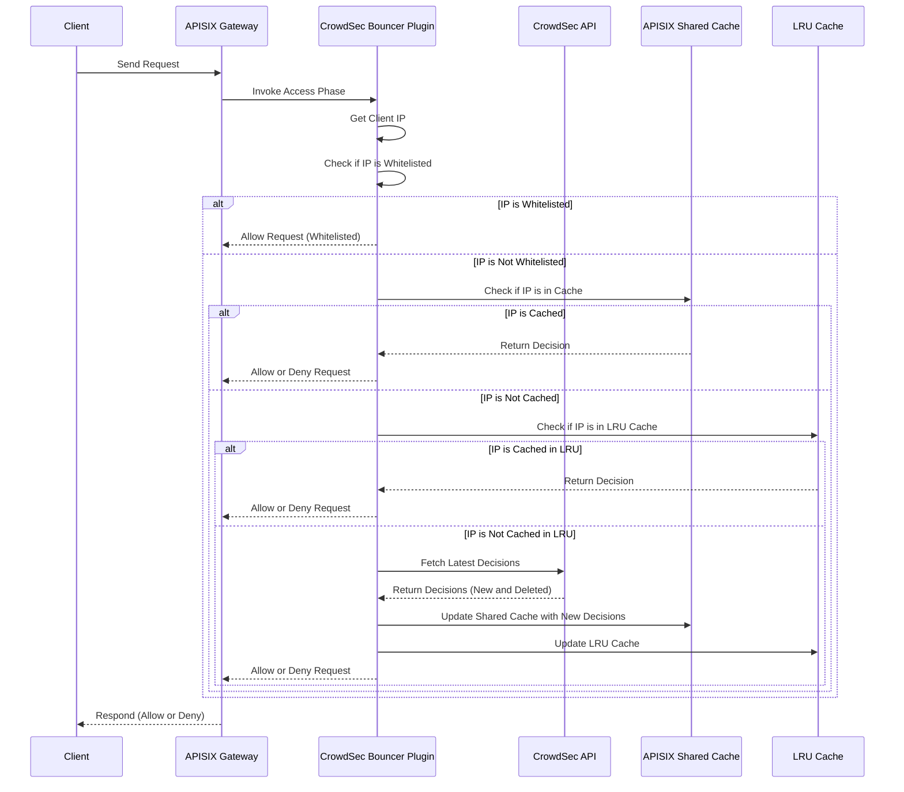

# CrowdSec Bouncer Plugin for APISIX

This plugin integrates CrowdSec's decision-making capabilities with Apache APISIX, allowing you to block IPs that have been flagged by CrowdSec. The plugin periodically fetches decisions from CrowdSec and applies them to incoming requests.

## Installation

To install the CrowdSec Bouncer Plugin for APISIX, add it to your APISIX plugins directory and configure it in your `config.yaml` and then enable it in `apisix.conf`.

## Configuration

### Plugin Attributes

This plugin requires certain attributes to be configured in your `config.yaml` under `plugin_attr` for the `crowdsec-bouncer` plugin.

Here is a breakdown of the available configuration options:

| Attribute               | Type     | Default | Required | Description                                                                                           |
|-------------------------|----------|---------|----------|-------------------------------------------------------------------------------------------------------|
| `crowdsec_lapi_scheme`  | string   | `http`  | Yes      | The scheme to use when connecting to the CrowdSec API (`http` or `https`).                             |
| `crowdsec_lapi_url`     | string   | None    | Yes      | The URL of the CrowdSec Local API (LAPI) without the scheme and port (e.g., `localhost`).              |
| `crowdsec_lapi_port`    | integer  | `8080`  | No       | The port number where CrowdSec LAPI is running.                                                        |
| `crowdsec_lapi_key`     | string   | None    | Yes      | The API key to authenticate with the CrowdSec LAPI.                                                   |
| `update_interval`       | integer  | `300`   | No      | Interval (in seconds) at which the plugin will fetch the latest decisions from CrowdSec.               |
| `ssl_verify`            | boolean  | `false` | No       | Whether to verify the SSL certificate when connecting to the CrowdSec LAPI.                           |
| `whitelist`             | array    | `[]`    | No       | A list of IPs or subnets that should be excluded from blocking by the plugin (in CIDR notation).       |

Add the following configuration to your `config.yaml`:

```yaml
nginx_config:
  http:
    access_log_format: '$remote_addr - $remote_user [$time_local] "$request" $status $bytes_sent "$http_referer" "$http_user_agent" "$gzip_ratio"'
    custom_lua_shared_dict:
      plugin-crowdsec-bouncer: 10m
plugins:
  - real-ip
  - request-id
  # [Other plugins...]
  - crowdsec-bouncer

plugin_attr:
  crowdsec-bouncer:
    crowdsec_lapi_scheme: "http"
    crowdsec_lapi_url: "localhost"
    crowdsec_lapi_port: 8080
    crowdsec_lapi_key: "your_api_key_here"
    update_interval: 300
    ssl_verify: false
    whitelist:
      - "192.168.1.0/24"
      - "10.0.0.1"
```

## How It Works


1. **Initialization**: During the initialization phase of APISIX, the CrowdSec Bouncer Plugin sets up a recurring timer that triggers the `fetch_crowdsec_decisions` function at the interval specified by `update_interval`. This function fetches the latest decisions from the CrowdSec LAPI.

2. **Fetching Decisions**: The plugin makes an HTTP request to the CrowdSec LAPI to retrieve the latest decisions, including banned IPs. These decisions are stored in both a shared memory cache (for inter-worker communication) and an LRU cache (for fast access within the worker).

3. **Request Handling**: When a request is received, the plugin first checks if the client's IP address is in the whitelist. If not, it proceeds to check the shared cache and the LRU cache. If the IP is found and marked for banning, the plugin returns a `403 Forbidden` response, blocking the request.

4. **Whitelisting**: The whitelist allows certain IPs or subnets to bypass the CrowdSec checks entirely, ensuring they are never blocked regardless of the decisions from CrowdSec.

5. **Caching**: The plugin uses a dual-layer caching mechanism to efficiently manage IP decisions. The shared cache ensures consistency across APISIX workers, while the LRU cache speeds up repeated lookups within a single worker.

The following sequence diagram provides a visual representation of the plugin's request-handling process, including how it interacts with APISIX, CrowdSec, and the internal caching mechanisms:




## Usage

After configuring the plugin in your `config.yaml`, you can enable the CrowdSec Bouncer Plugin at different levels depending on your needs:

### 1. Global Plugin

To enable the CrowdSec Bouncer Plugin globally for all routes, add it to your `apisix.yaml` as a global rule:

```yaml
global_rules:
  - id: 1
    plugins:
      crowdsec-bouncer:
        enable: true
```
This setup ensures that every request passing through the API Gateway is checked against CrowdSec decisions, providing comprehensive protection across all services.

### 2. Route-Level Plugin

If you prefer to apply the CrowdSec Bouncer Plugin to specific routes, you can enable it at the route level. This allows you to protect particular services without affecting others. Below is an example of how to enable the plugin for a specific route:

```yaml
routes:
  - uri: /your-service-endpoint
    plugins:
      crowdsec-bouncer:
        enable: true
    upstream:
      nodes:
        "your-upstream-service:80": 1
      type: roundrobin
```

This configuration will only enforce CrowdSec decisions on the specified route, allowing you to selectively protect different parts of your API.

### Further Reading
For a detailed walkthrough on how to configure and utilize this plugin effectively, please refer to [my Medium article](https://medium.com/@mostafahussein/fortify-your-api-introducing-the-crowdsec-bouncer-plugin-for-apisix-ae7a02dd72cb), where I provide an in-depth guide and additional insights.


## License

This plugin is open-source and available under the Apache 2.0 License.